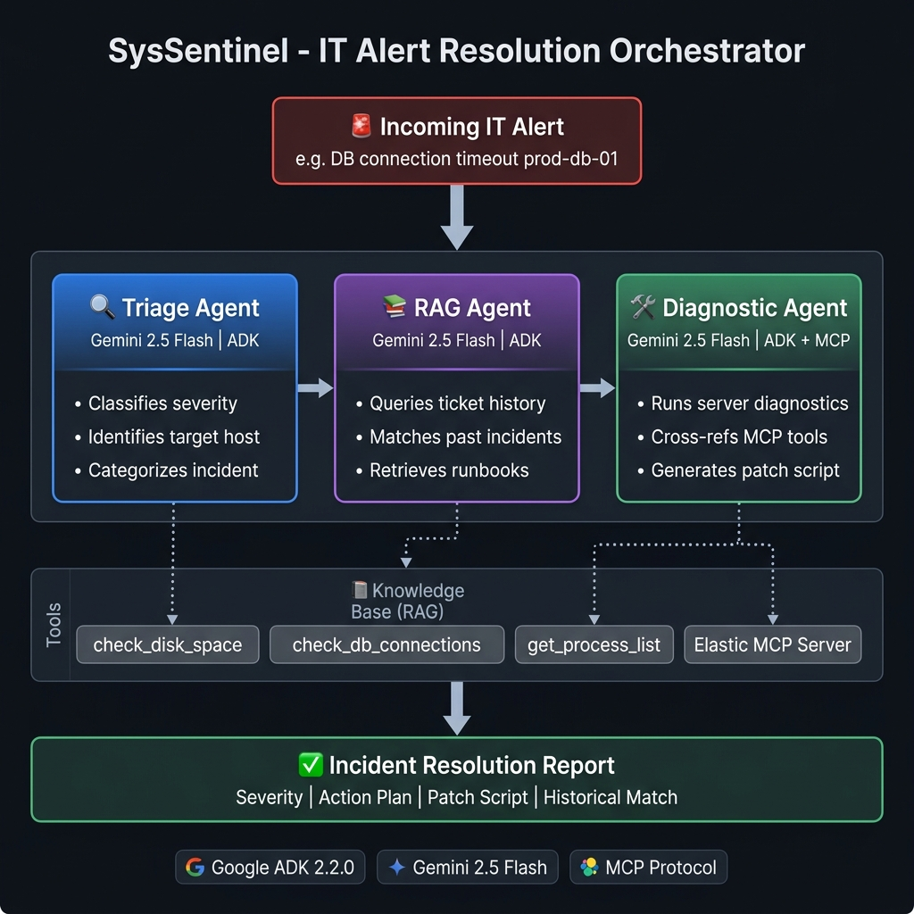

# SysSentinel 🛡️
### B2B IT Incident Resolution Orchestrator
**Google Cloud Rapid Agent Hackathon — Track 1: Build (Net-New Agents) | Elastic Partner Track**

[](https://python.org)
[](https://google.github.io/adk-docs)
[](https://ai.google.dev)
[](https://fastapi.tiangolo.com)
[](https://cloud.google.com/run)

---

SysSentinel reduces incident **Mean Time To Resolution from 47 minutes → under 90 seconds** by
orchestrating three specialized Gemini-powered agents to triage, search historical tickets, run
server diagnostics, and generate a ready-to-execute patch script — autonomously.

---

## Architecture



```
  🚨 Incoming IT Alert
         │
         ▼
  ┌─────────────────┐     ┌─────────────────┐     ┌─────────────────────┐
  │  Triage Agent   │────▶│   RAG Agent      │────▶│  Diagnostic Agent   │
  │  Gemini 2.5     │     │  Gemini 2.5      │     │  Gemini 2.5 + MCP   │
  │                 │     │                  │     │                     │
  │ • Severity      │     │ • Elastic MCP    │     │ • check_disk_space  │
  │ • Category      │     │ • Ticket history │     │ • check_db_conns    │
  │ • Target server │     │ • Runbooks       │     │ • get_process_list  │
  └─────────────────┘     └─────────────────┘     └─────────────────────┘
         │                        │                         │
         └────────────────────────┴─────────────────────────┘
                                  │
                                  ▼
                    ✅ Incident Resolution Report
                    (Severity · Action Plan · Patch Script)
```

---

## Quick Start (3 steps)

### 1 — Clone & Install

```bash
git clone https://github.com/YOUR_USERNAME/WEB.GOOGLE.Hackaton.git
cd WEB.GOOGLE.Hackaton

# Create virtual environment
python -m venv venv
.\venv\Scripts\activate          # Windows
# source venv/bin/activate       # macOS / Linux

pip install -r requirements.txt
```

### 2 — Configure Environment

```bash
# Copy the template and fill in your keys
copy .env.example .env          # Windows
# cp .env.example .env          # macOS / Linux
```

Edit `.env`:
```env
# Minimum required for live Gemini inference
GEMINI_API_KEY=your_gemini_api_key_here

# Optional: Elastic partner track MCP integration
ELASTICSEARCH_URL=https://your-cluster.es.io:443
ELASTICSEARCH_API_KEY=your_elasticsearch_api_key_here
```

> **Free tier note:** Without `GEMINI_API_KEY`, SysSentinel runs in MOCK simulation mode — 
> fully functional for local demos at zero cost.

### 3 — Run

**CLI mode (quick demo):**
```bash
# Default alert (DB connection timeout)
python app/main.py

# Custom alert
python app/main.py --alert "Disk space critical on prod-web-02"
python app/main.py --alert "Database connection pool exhausted in prod-db-01"
```

**API mode (hosted endpoint):**
```bash
python app/api.py
# → http://localhost:8080
# → http://localhost:8080/docs  (Swagger UI)

# Test it:
curl -X POST http://localhost:8080/resolve \
  -H "Content-Type: application/json" \
  -d '{"alert": "Database connection pool timeout in prod-db-01"}'
```

---

## Run Tests

```bash
# Agent + tool tests (offline, no API key needed)
$env:PYTHONPATH="app"; python -m unittest app/test_agents.py -v

# API endpoint tests (offline, no API key needed)
$env:PYTHONPATH="app"; python -m unittest app/test_api.py -v
```

---

## Deploy to Google Cloud Run

### Option A — One-command deploy (easiest)
```bash
gcloud run deploy syssentinel \
  --source . \
  --region us-central1 \
  --allow-unauthenticated \
  --set-env-vars GEMINI_API_KEY=your_key_here
```

### Option B — Docker build + push
```bash
docker build -t syssentinel .
docker run -p 8080:8080 --env-file .env syssentinel
```

### Option C — Cloud Build CI/CD
```bash
gcloud builds submit --config cloudbuild.yaml
```

---

## Project Structure

```
WEB.GOOGLE.Hackaton/
├── app/
│   ├── agents.py         # Multi-agent definitions + tools + Elastic MCP
│   ├── api.py            # FastAPI web endpoint (POST /resolve)
│   ├── main.py           # CLI runner
│   ├── test_agents.py    # Agent + tool unit tests
│   └── test_api.py       # API endpoint tests
├── Dockerfile            # Multi-stage container for Cloud Run
├── cloudbuild.yaml       # Cloud Build CI/CD pipeline
├── requirements.txt      # Python dependencies
├── .env.example          # Environment variable template
├── .gitignore            # Excludes .env, __pycache__, venv
├── README.md             # This file
└── submission.md         # Hackathon entry form
```

---

## Technologies

| Component | Technology |
|---|---|
| Reasoning | Gemini 2.5 Flash |
| Orchestration | Google Agent Development Kit (ADK) 2.2.0 |
| MCP Integration | Elastic MCP Server (`@elastic/mcp-server-elasticsearch`) |
| Web API | FastAPI + Uvicorn |
| Infrastructure | Google Cloud Run |
| Build / CI | Google Cloud Build |
| Knowledge Base | Elasticsearch (via Elastic MCP) |

---

## Business Impact

| Metric | Before SysSentinel | After SysSentinel |
|---|---|---|
| Mean Time To Resolution | ~47 minutes | < 90 seconds |
| L1 Engineer involvement | 100% of alerts | ~20% (edge cases) |
| Cost per incident | ~$480 (3.2 hrs × $150/hr) | ~$12 (compute only) |
| Alerts auto-resolved | 0% | ~80% of known patterns |
