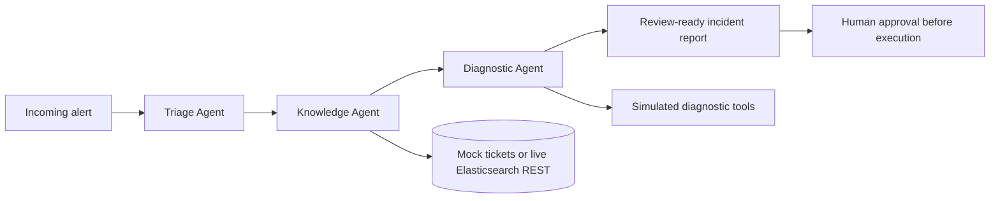

# SysSentinel

### Human-in-the-loop IT incident investigation with Gemini and Google ADK

**Google Cloud Rapid Agent Hackathon - Track 1: Build**

SysSentinel turns a raw infrastructure alert into a structured, review-ready incident
report. A Python orchestrator coordinates three specialized agents to classify the
incident, retrieve similar historical resolutions, inspect diagnostic data, and propose
a remediation script.

The generated script is **never executed automatically**. It is clearly marked for
operator review and approval.

## Why It Matters

On-call engineers often repeat the same investigation workflow: classify an alert,
search past tickets, inspect the affected host, and draft a remediation. SysSentinel
demonstrates how specialized agents can coordinate that workflow and return a useful
first response in seconds.

## Architecture



### Agent Responsibilities

| Agent | Responsibility |
|---|---|
| Triage Agent | Classifies severity, category, and target host |
| Knowledge Agent | Retrieves a relevant historical incident and resolution |
| Diagnostic Agent | Inspects diagnostic data and drafts an action plan and script |

## Evidence Modes

SysSentinel always reports which sources produced a result:

| Field | Meaning |
|---|---|
| `run_mode` | `LIVE_ADK`, `LIVE_GENAI`, or `MOCK` |
| `knowledge_source` | `elastic_rest_live` or `mock_knowledge_base` |
| `diagnostics_source` | Currently `simulated_diagnostic_tools` |
| `remediation_requires_approval` | Always `true` |

Without credentials, the complete workflow runs deterministically in mock mode. This
makes the project easy to evaluate while keeping live integrations explicit.

## Quick Start

Requirements: Python 3.11 and `pip`.

```bash
python -m venv .venv

# Windows
.\.venv\Scripts\activate

# macOS/Linux
# source .venv/bin/activate

pip install -r requirements.txt
copy .env.example .env
```

Add a Gemini API key to `.env` for live reasoning. Without one, the app uses mock mode.

```env
GEMINI_API_KEY=your_key_here
DEMO_API_KEY=generate_a_long_random_value
```

When live Gemini is enabled, `DEMO_API_KEY` is required and protects `POST /resolve`.
Mock mode remains keyless for easy offline evaluation.

Optional live Elasticsearch ticket retrieval:

```env
ELASTICSEARCH_URL=https://your-cluster.es.io:443
ELASTICSEARCH_API_KEY=your_api_key_here
```

### Run The API

```bash
python app/api.py
```

Open `http://localhost:8080/docs`, or call the API directly:

```bash
curl -X POST http://localhost:8080/resolve \
  -H "Content-Type: application/json" \
  -H "X-Demo-Key: your_demo_key" \
  -d "{\"alert\":\"Database connection pool timeout in prod-db-01\",\"context\":\"production\"}"
```

### Run The CLI Demo

```bash
python app/main.py
python app/main.py --alert "Disk space critical on prod-web-02"
```

## API

### `POST /resolve`

Live deployments require the private `X-Demo-Key` request header. The header appears in
Swagger UI as an input field. Keep the key out of GitHub and public submission text.

Request:

```json
{
  "alert": "Database connection pool timeout in prod-db-01",
  "context": "production"
}
```

The response contains triage, historical knowledge, diagnostics, a proposed action
plan, a review-required script, elapsed time, and source disclosures.

Other endpoints:

- `GET /` - health, mode, and safety disclosure
- `GET /resolve/examples` - judge-friendly example requests
- `GET /docs` - interactive Swagger UI

## Tests

Tests run offline without credentials:

```bash
$env:PYTHONPATH="app"; python -m unittest discover -s app -p "test_*.py" -v
```

## Deploy To Cloud Run

Follow [DEPLOYMENT.md](./DEPLOYMENT.md) for the dedicated-project, least-privilege,
Secret Manager, budget, GitHub publication, and shutdown workflow. The included
`cloudbuild.yaml` limits the public demo to one instance and injects pinned secret
versions.

## Technology

- Gemini 2.5 Flash for live reasoning
- Google Agent Development Kit for live agent execution
- FastAPI and Uvicorn for the webhook API
- Google Cloud Run and Cloud Build for deployment
- Optional Elasticsearch REST retrieval for historical tickets
- Deterministic mock knowledge and diagnostics for reproducible evaluation

## Current Boundaries

- Diagnostic tools use simulated data; they do not connect to production hosts.
- Generated remediation scripts require human review and are not executed.
- Elastic MCP is a future integration path. The current optional live integration uses
  the Elasticsearch REST API.
- Claimed operational savings require validation in a real deployment.

